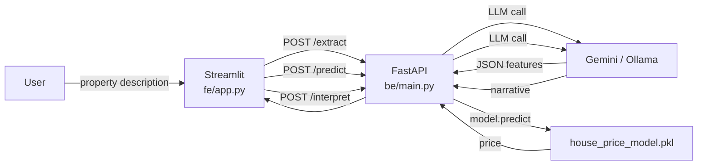

# House Prices — Advanced Regression with LLM Agent

A 3-stage LLM agent that takes a plain-English property description and returns a predicted sale price with a narrative explanation.  
Built for the Ames Housing dataset (Kaggle competition).

Test the website on [](https://realestateagent-fe-production.up.railway.app)

---

## Architecture



### Stage breakdown

| Stage | Endpoint | What it does |
|-------|----------|--------------|
| 1 — Extract | `POST /extract` | LLM parses free-text description → structured JSON features |
| 2 — Predict | `POST /predict` | RandomForest model predicts sale price from features |
| 3 — Interpret | `POST /interpret` | LLM generates a human-readable price narrative |

---

## Model Performance

| Metric | Value |
|--------|-------|
| Algorithm | RandomForestRegressor (100 estimators) |
| R² (test) | **0.906** |
| Test RMSE | ~$26,727 |
| Test MAE | ~$17,500 |
| Features | 12 (GrLivArea, OverallQual, GarageCars, TotalBsmtSF, …) |

Training split: 70% train / 15% validation / 15% test.  
See [`model/train.py`](model/train.py) and [`model/training_metrics.json`](model/training_metrics.json) for full details.

---

## Project Structure

```
house-prices-advanced-regression-techniques/
├── be/
│   └── main.py              # FastAPI app (3-stage agent)
├── config/
│   ├── requirements.txt     # Python dependencies
│   ├── schemas.py           # Pydantic request/response models
│   └── .env                 # Local secrets — NOT committed
├── fe/
│   └── app.py               # Streamlit frontend
├── model/
│   ├── train.py             # Training script
│   ├── house_price_model.pkl # Serialized RandomForest model
│   └── training_metrics.json
├── Dockerfile
└── house_prices_analysis.ipynb  # Colab notebook (EDA + ML + prompt experiments)
```

---

## Local Setup

### Prerequisites

- Python 3.11+
- A Gemini API key **or** a running [Ollama](https://ollama.ai) instance

### 1. Clone & install

```bash
git clone https://github.com/<your-username>/house-prices-advanced-regression-techniques.git
cd house-prices-advanced-regression-techniques
python -m venv .venv
# Windows
.venv\Scripts\activate
# macOS / Linux
source .venv/bin/activate

pip install -r config/requirements.txt
```

### 2. Configure environment

Create `config/.env`:

```env
LLM_PROVIDER=gemini          # or "ollama"
GEMINI_API_KEY=your_key_here
OLLAMA_HOST=http://localhost:11434
MODEL_NAME=phi3
```

### 3. Run the backend

```bash
uvicorn be.main:app --reload --port 8080
```

### 4. Run the frontend

```bash
streamlit run fe/app.py
```

Open [http://localhost:8501](http://localhost:8501) and enter a property description.

---

## Docker

```bash
# Build
docker build -t house-prices-agent .

# Run (pass your API key at runtime — never bake secrets into the image)
docker run -p 8080:8080 \
  -e LLM_PROVIDER=gemini \
  -e GEMINI_API_KEY=<apikey> \
  house-prices-agent
```

---

## Google Colab Notebook

> `house_prices_analysis.ipynb` — EDA, ML pipeline replication, and prompt engineering experiments.

[](https://colab.research.google.com/drive/10LKpLw8_w1qk0bb2Snn7MCV6cJTKKFHf?usp=sharing)

---

## API Reference

### `POST /extract`
Extracts structured features from a natural-language property description.

**Request body**
```json
{ "description": "A 3-bed, 2-bath colonial built in 1998 with 1,800 sqft…" }
```

**Response**
```json
{
  "GrLivArea": 1800, "OverallQual": 7, "GarageCars": 2,
  "YearBuilt": 1998, "TotalBsmtSF": 900, ...
}
```

### `POST /predict`
Returns a price prediction from a feature payload.

### `POST /interpret`
Returns a narrative explanation of the prediction.

---

## Notes on committed artifacts

- `model/house_price_model.pkl` is committed intentionally to satisfy the "serialized model" deliverable requirement. For production use, store large model files in object storage (S3, GCS) and load them at startup.
